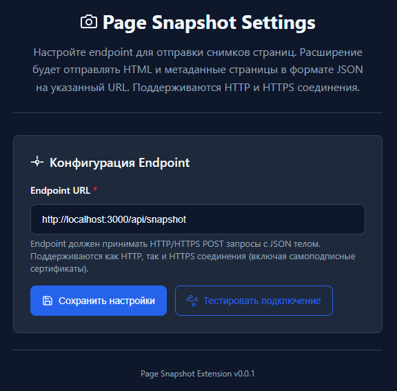

# Page Snapshot

> **Note:** This project is currently localized in Russian. English documentation can be provided upon request for international contributors.

Chrome расширение для создания полных снимков веб-страниц с последующей конвертацией в Markdown формат. Система состоит из трех компонентов: Chrome расширения для захвата страниц, NestJS API сервера для обработки данных и React веб-приложения для просмотра контента.

## Архитектура

Проект представляет собой полнофункциональную систему для сохранения и просмотра веб-контента:

- **Chrome Extension** — захватывает полный DOM страницы по клику пользователя
- **Backend API** — принимает данные, сохраняет их и конвертирует HTML в Markdown
- **Frontend Viewer** — веб-интерфейс для просмотра сохраненного контента

## Быстрый старт

### Требования
- Node.js 18+
- Chrome браузер (Manifest V3)
- Права на запись в файловую систему

### Установка

1. **Клонируйте репозиторий:**
   ```bash
   git clone <repository-url>
   cd page-snapshot
   ```

2. **Установите зависимости всех компонентов:**
   ```bash
   # Backend
   cd app/backend
   npm install --legacy-peer-deps
   
   # Extension
   cd ../extension
   npm install
   
   # Frontend
   cd ../frontend
   npm install
   ```

3. **Настройте окружение:**
   ```bash
   # Backend
   cd app/backend
   cp env.config .env
   # Отредактируйте .env файл
   
   # Frontend
   cd ../frontend
   cp env.config .env
   # Отредактируйте .env файл
   ```

4. **Запустите систему:**
   ```bash
   # Backend (терминал 1)
   cd app/backend
   npm run start:dev
   
   # Frontend (терминал 2)
   cd app/frontend
   npm run dev
   
   # Extension (терминал 3)
   cd app/extension
   npm run build
   # Загрузите dist/ в Chrome
   ```

## Компоненты

### Chrome Extension
- **Назначение:** Захват полного DOM веб-страниц
- **Технологии:** TypeScript, Vite, Chrome Extensions API (Manifest V3)
- **Функции:** Создание снимков по клику, отправка на API, настройка endpoint
- **Документация:** [app/extension/README.md](app/extension/README.md)


### Backend API
- **Назначение:** Обработка снимков и конвертация в Markdown
- **Технологии:** NestJS 11, TypeScript 5, Express
- **Функции:** Прием данных, файловое хранение, система плагинов (стандартные + пользовательские), Swagger API
- **Документация:** [app/backend/README.md](app/backend/README.md)

### Frontend Viewer
- **Назначение:** Просмотр сохраненного контента в Markdown формате
- **Технологии:** React 19, TypeScript, Vite, Tailwind CSS
- **Функции:** Отображение контента, экспорт в файлы, копирование в буфер
- **Документация:** [app/frontend/README.md](app/frontend/README.md)


## Принцип работы

1. **Настройка:** Пользователь настраивает endpoint для отправки данных



2. **Захват:** Пользователь кликает по иконке расширения на любой веб-странице
3. **Отправка:** Расширение отправляет полный HTML + метаданные на backend API
4. **Сохранение:** Backend сохраняет данные в файловое хранилище с контрольными суммами
5. **Конвертация:** Система плагинов преобразует HTML в читаемый Markdown
6. **Просмотр:** Frontend отображает контент в удобном интерфейсе с возможностью экспорта

## Особенности

- **Полный DOM:** Захватывается точная копия страницы включая динамический контент
- **Система плагинов:** Поддержка стандартных и пользовательских плагинов для конвертации HTML в Markdown без ограничений
- **Модульная архитектура:** Легко расширяемая система обработки контента
- **Безопасность:** CORS, валидация данных, контрольные суммы
- **Производительность:** Файловое хранение, кеширование, оптимизированный рендеринг
- **Минимальные разрешения:** Расширение использует только необходимые права

## Разработка

### Структура проекта
```
page-snapshot/
├── app/
│   ├── backend/          # NestJS API сервер
│   ├── extension/        # Chrome расширение
│   └── frontend/         # React веб-приложение
└── README.md
```

### Команды разработки
```bash
# Backend
cd app/backend
npm run start:dev        # Режим разработки
npm run start:debug      # Режим отладки
npm run build           # Сборка

# Extension
cd app/extension
npm run dev             # Режим разработки с hot reload
npm run build           # Сборка для продакшена

# Frontend
cd app/frontend
npm run dev             # Режим разработки
npm run build           # Сборка для продакшена
```

## API

- **POST /api/snapshot** — прием снимков от Chrome расширения
- **GET /api/md** — получение контента в Markdown формате
- **Swagger UI:** http://localhost:3000/api/docs

## Лицензия

MIT License — см. файл [LICENSE](LICENSE)
