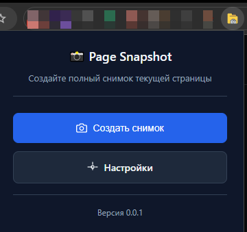

# Page Snapshot Chrome Extension

Chrome расширение для создания полных снимков веб-страниц и отправки их на ваш API endpoint.

## Назначение

Расширение создает точную копию текущего состояния страницы (полный DOM) и отправляет её на настроенный сервер в формате JSON. Работает только по явному действию пользователя — клику по иконке расширения.

**Что отправляется:**
- Полный HTML страницы (`document.documentElement.outerHTML`)
- URL активной вкладки
- Заголовок страницы
- Временная метка
- User Agent браузера

**Формат данных:** Подробная документация API с примерами запросов и ответов доступна в [Swagger UI](http://localhost:3000/api/docs) после запуска backend сервера.

## Как установить

### Требования
- Chrome браузер (Manifest V3)
- Node.js 18+ для разработки
- Ваш API endpoint для приема данных

### Установка для разработки

1. **Клонируйте репозиторий:**
   ```bash
   git clone <repository-url>
   cd page-snapshot
   ```

2. **Установите зависимости расширения:**
   ```bash
   cd app/extension
   npm install
   ```

3. **Соберите расширение:**
   ```bash
   npm run build
   ```

4. **Загрузите в Chrome:**
   - Откройте `chrome://extensions/`
   - Включите "Режим разработчика"
   - Нажмите "Загрузить распакованное расширение"
   - Выберите папку `app/extension/dist/`

### Установка готового расширения

1. Скачайте файл `.crx` из релизов
2. Перетащите файл в `chrome://extensions/`
3. Подтвердите установку

## Как использовать

### Первоначальная настройка

1. **Настройте endpoint:**
   - Кликните по иконке расширения
   - Нажмите "Настройки"
   - Введите URL вашего API endpoint
   - Нажмите "Сохранить"


2. **Протестируйте подключение:**
   - В настройках нажмите "Тестировать подключение"
   - Убедитесь, что сервер отвечает корректно

### Создание снимков

1. **Откройте нужную страницу** в Chrome
2. **Кликните по иконке расширения** в панели инструментов
3. **Нажмите "Создать снимок"**
4. **Дождитесь уведомления** об успешной отправке



### Настройки

**Обязательные настройки:**
- `Endpoint URL` — адрес вашего API для приема данных

**Дополнительные возможности:**
- Тестирование подключения к API
- Просмотр детальной информации об ошибках
- Автоматическое сохранение настроек

### Требования к API

Ваш сервер должен принимать POST запросы с поддержкой CORS для Chrome расширений. Подробные требования к формату данных и настройке сервера описаны в [документации backend API](http://localhost:3000/api/docs).

### Разрешения

Расширение использует минимальные разрешения:
- `activeTab` — доступ к активной вкладке
- `scripting` — чтение DOM страницы
- `storage` — сохранение настроек
- `notifications` — уведомления пользователю

### Устранение проблем

**"Не настроен endpoint URL":**
- Перейдите в настройки расширения
- Введите корректный URL вашего API

**"Ошибка сети":**
- Проверьте доступность endpoint
- Убедитесь, что сервер поддерживает CORS
- Проверьте SSL сертификат

**"Невозможно создать снимок системных страниц":**
- Расширение не работает на chrome:// страницах
- Используйте обычные веб-сайты

### Разработка

**Структура проекта:**
```
page-snapshot/                    # Корневой репозиторий
├── app/
│   ├── extension/               # Chrome расширение
│   │   ├── src/
│   │   │   ├── background/     # Service Worker
│   │   │   ├── popup/         # Интерфейс расширения
│   │   │   └── options/       # Страница настроек
│   │   ├── dist/              # Собранное расширение
│   │   └── package.json
│   ├── backend/                # NestJS API сервер
│   └── frontend/               # React веб-приложение
└── README.md
```

**Команды для расширения:**
```bash
cd app/extension
npm run dev        # Режим разработки с hot reload
npm run build      # Сборка для продакшена
```

**Технологии:**
- TypeScript
- Vite + @crxjs/vite-plugin
- Chrome Extensions API (Manifest V3)
